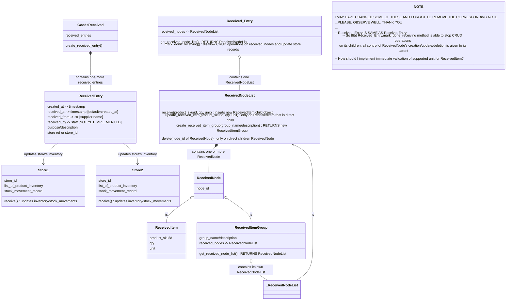

```mermaid

classDiagram
    
    GoodsReceived *-- ReceivedEntry: contains one/more received entries
    
    ReceivedEntry --> Store1: updates store's inventory
    ReceivedEntry --> Store2: updates store's inventory
    
    Received_Entry o-- ReceivedNodeList: contains one ReceivedNodeList
    ReceivedNodeList *-- ReceivedNode: contains one or more ReceivedNode
    
    ReceivedNode <|-- ReceivedItem: is
    ReceivedNode <|-- ReceivedItemGroup: is 
    
    ReceivedItemGroup o-- _ReceivedNodeList: contains its own ReceivedNodeList
    _ReceivedNodeList --> ReceivedNodeList: is
    
   
   GoodsReceived: create_received_entry()
   GoodsReceived: received_entries
    
    ReceivedEntry: created_at -> timestamp
    ReceivedEntry: received_at -> timestamp [default=created_at]
    ReceivedEntry: received_from -> str [supplier name]
    ReceivedEntry: received_by -> staff [NOT YET IMPLEMENTED]
    ReceivedEntry: purpose/description
    ReceivedEntry: store ref or store_id
    
    
    Store1: store_id
    Store1:  list_of_product_inventory
    Store1: stock_movement_record
    Store1: receive() updates inventory/stock_movements
    
    Store2: store_id  
    Store2: list_of_product_inventory
    Store2: stock_movement_record
    Store2: receive() updates inventory/stock_movements
    
    
    
    Received_Entry: received_nodes -> ReceivedNodeList
    Received_Entry: get_received_node_list() RETURNS ReceivedNodeList
    Received_Entry: mark_done_receiving() disallow CRUD operations on received_nodes and update store records
    
    
    
    ReceivedNodeList: receive(product_sku/id, qty, unit) inserts new ReceivedItem child object
    ReceivedNodeList: update_received_item(product_sku/id, qty, unit) only on ReceivedItem that is direct child
    ReceivedNodeList: create_received_item_group(group_name/description) RETURNS new ReceivedItemGroup
    ReceivedNodeList: delete(node_id of ReceivedNode) only on direct children ReceivedNode
     
     
    ReceivedNode: node_id
     
     
    ReceivedItem: product_sku/id
    ReceivedItem: qty
    ReceivedItem: unit
     
    
    ReceivedItemGroup: group_name/description
    ReceivedItemGroup: received_nodes -> ReceivedNodeList
    ReceivedItemGroup: get_received_node_list() RETURNS ReceivedNodeList
    
    
    
    
    NOTE: I MAY HAVE CHANGED SOME OF THESE AND FORGOT TO REMOVE THE CORRESPONDiNG NOTE
    NOTE: ...PLEASE, OBSERVE WELL. THANK YOU
    NOTE: ...
    NOTE: -- Received_Entry IS SAME AS ReceivedEntry
    NOTE: -- So that Received_Entry.mark_done_receiving method is able to stop CRUD operations
    NOTE: on its children, all control of ReceivedNode's creation/update/deletion is given to its parent
    NOTE: -- How should I implement immediate validation of supported unit for ReceivedItem?

```