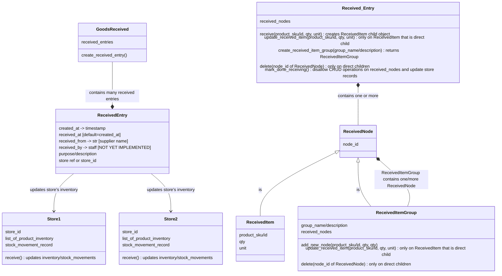
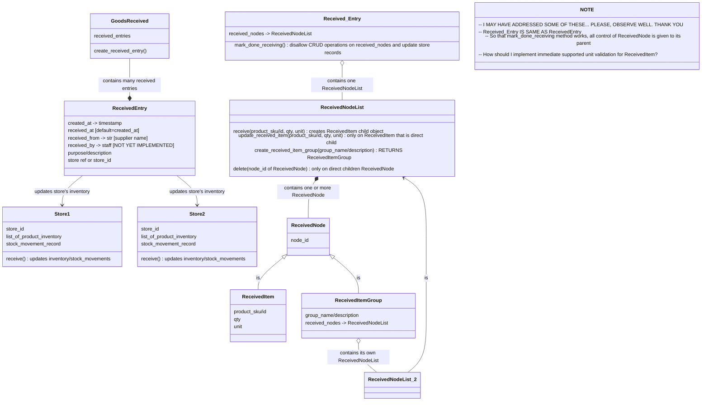

### DESIGN IDEA #1  

```mermaid

classDiagram
    
    Store1: store_id
    Store1:  list_of_product_inventory
    Store1: stock_movement_record
    Store1: receive() updates inventory/stock_movements
    
    
    Store2: store_id  
    Store2: list_of_product_inventory
    Store2: stock_movement_record
    Store2: receive() updates inventory/stock_movements
    
    
    GoodsReceived: create_received_entry()
    GoodsReceived: received_entries
    
    ReceivedEntry: created_at -> timestamp
    ReceivedEntry: received_at [default=created_at]
    ReceivedEntry: received_from -> str [supplier name]
    ReceivedEntry: received_by -> staff [NOT YET IMPLEMENTED]
    ReceivedEntry: purpose/description
    ReceivedEntry: store ref or store_id

    
    GoodsReceived --* ReceivedEntry: contains many received entries
    
    ReceivedEntry --> Store1: updates store's inventory
    ReceivedEntry --> Store2: updates store's inventory
    
    
    
    
    Received_Entry *-- ReceivedNode: contains one or more
    ReceivedNode <|-- ReceivedItem: is
    ReceivedNode <|-- ReceivedItemGroup: is 
    ReceivedNode *-- ReceivedItemGroup: ReceivedItemGroup contains one/more ReceivedNode
    
    
    Received_Entry: received_nodes
    Received_Entry: receive(product_sku/id, qty, unit) creates ReceivedItem child object
    Received_Entry: update_received_item(product_sku/id, qty, unit) only on ReceivedItem that is direct child
    Received_Entry: create_received_item_group(group_name/description) returns ReceivedItemGroup
    Received_Entry: delete(node_id of ReceivedNode) only on direct children
    Received_Entry: mark_done_receiving() disallow CRUD operations on received_nodes and update store records
     
     
    ReceivedNode: node_id
     
     
    ReceivedItemGroup: group_name/description
    ReceivedItemGroup: received_nodes
    ReceivedItemGroup: add_new_node(product_sku/id, qty, qty)
    ReceivedItemGroup: update_received_item(product_sku/id, qty, unit) only on ReceivedItem that is direct child
   ReceivedItemGroup: delete(node_id of ReceivedNode) only on direct children
    
    
    ReceivedItem: product_sku/id
    ReceivedItem: qty
    ReceivedItem: unit
    
    
    

```

### DESIGN IDEA REFINED

```mermaid
classDiagram
    
    Store1: store_id
    Store1: list_of_product_inventory
    Store1: stock_movement_record
    Store1: receive() updates inventory/stock_movements
    
    
    Store2: store_id  
    Store2: list_of_product_inventory
    Store2: stock_movement_record
    Store2: receive() updates inventory/stock_movements
    
    
    GoodsReceived: create_received_entry()
    GoodsReceived: received_entries
    
    ReceivedEntry: created_at -> timestamp
    ReceivedEntry: received_at [default=created_at]
    ReceivedEntry: received_from -> str [supplier name]
    ReceivedEntry: received_by -> staff [NOT YET IMPLEMENTED]
    ReceivedEntry: purpose/description
    ReceivedEntry: store ref or store_id

    
    GoodsReceived --* ReceivedEntry: contains many received entries
    
    ReceivedEntry --> Store1: updates store's inventory
    ReceivedEntry --> Store2: updates store's inventory
    
    
    
    
    Received_Entry o-- ReceivedNodeList: contains one ReceivedNodeList
    
    ReceivedNodeList *-- ReceivedNode: contains one or more ReceivedNode
    ReceivedNode <|-- ReceivedItem: is
    ReceivedNode <|-- ReceivedItemGroup: is 
    
    
    ReceivedItemGroup o-- ReceivedNodeList_2: contains its own ReceivedNodeList
    ReceivedNodeList_2 --> ReceivedNodeList: is
    
    Received_Entry: received_nodes -> ReceivedNodeList
    Received_Entry: mark_done_receiving() disallow CRUD operations on received_nodes and update store records
    
    
    
    ReceivedNodeList: receive(product_sku/id, qty, unit) creates ReceivedItem child object
    ReceivedNodeList: update_received_item(product_sku/id, qty, unit) only on ReceivedItem that is direct child
    ReceivedNodeList: create_received_item_group(group_name/description) RETURNS ReceivedItemGroup
    ReceivedNodeList: delete(node_id of ReceivedNode) only on direct children ReceivedNode
     
     
    ReceivedNode: node_id
     
     
    ReceivedItemGroup: group_name/description
    ReceivedItemGroup: received_nodes -> ReceivedNodeList
    
    
    ReceivedItem: product_sku/id
    ReceivedItem: qty
    ReceivedItem: unit
    
    
    
    NOTE: -- I MAY HAVE ADDRESSED SOME OF THESE... PLEASE, OBSERVE WELL. THANK YOU 
    NOTE: -- Received_Entry IS SAME AS ReceivedEntry
    NOTE: -- So that mark_done_receiving method works, all control of ReceivedNode is given to its parent
    NOTE: -- How should I implement immediate supported unit validation for ReceivedItem?

```